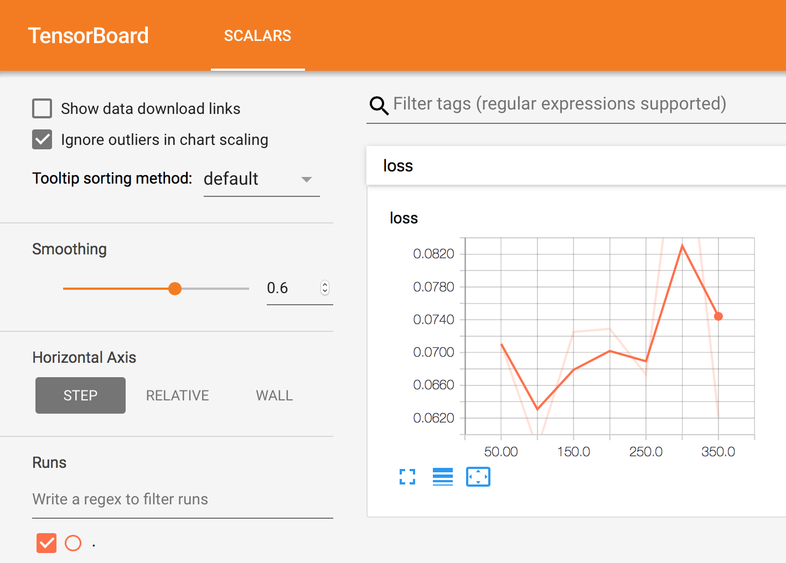

# Tensorboard

> Tensorboard is a useful tool to monitor the training process of tensorflow.

Note that _tf.summary_ is used in _5\_summary.py_ to store the loss curves.

You can save all the loggings into summary and visualize the loss curves using tensorboard.

Type the following in terminal
```bash
tensorboard --logdir=[director to store summary]
```

And then go to the following address in your browser:
[http://localhost:6006](http://localhost:6006/#scalars)

you will see something similar to this:
<div>
    
</div>